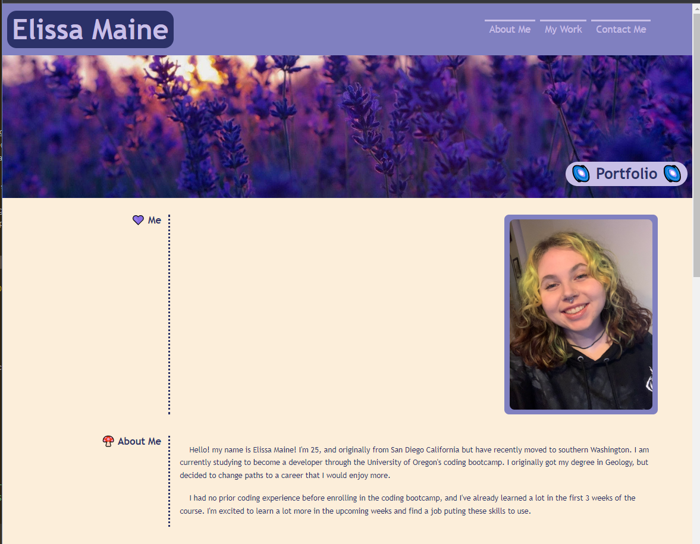
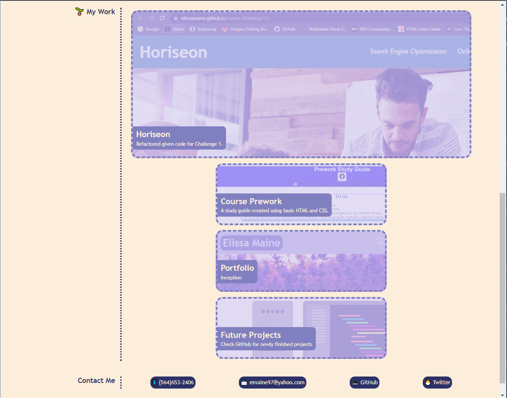
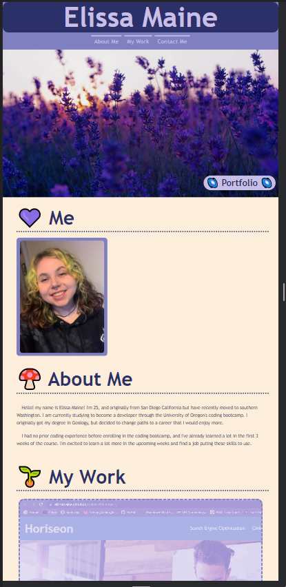
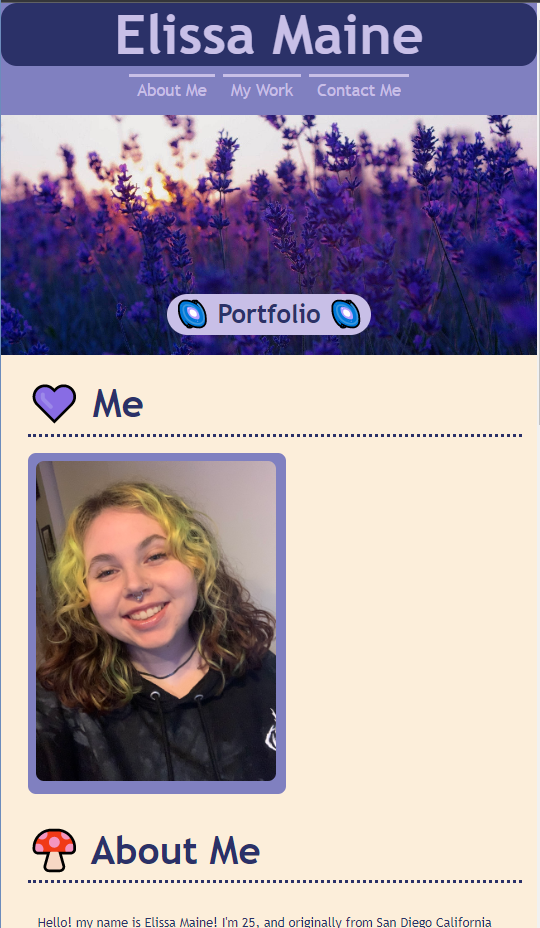

# Portfolio

## Description

This portfolio was created to show peers and future employers my skill level and all that I have achived. I will be able to add to this portfolio and improve the code as the course goes on. Having this portfolio with all of my deployed applications will improve my job search after graduation and will help me stand out.

## Screenshots

## Link to Deployed Application

[deployed website](https://elissamaine.github.io/Maine-Challenge-2/)